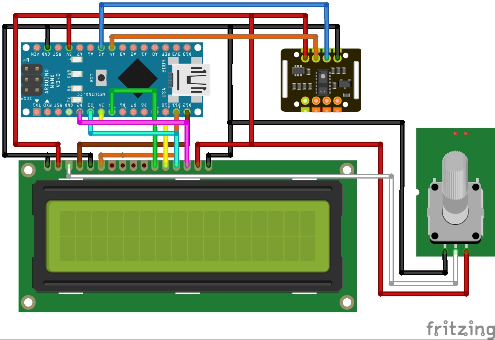

# Heart Rate and SpO2 Measurement

The Heart Rate and SpO2 Measurements Project is a software application that allows users to monitor and track their heart rate and blood oxygen saturation levels. It aims to provide a convenient and accessible solution for individuals who want to keep a close eye on their vital signs for health and wellness purposes.

## Table of Contents

- [Features](#features)
- [Getting Started](#getting-started)
- [Components](#components)
- [Usage](#usage)
- [Configuration](#configuration)

## Features

- **Real-time Heart Rate Monitoring**: The project enables users to monitor their heart rate in real-time, providing immediate feedback on their cardiovascular health status.
- **SpO2 Measurement**: The application also measures the blood oxygen saturation level (SpO2), which indicates the oxygen levels in the bloodstream. This feature helps users assess their respiratory well-being.

## Getting Started

To get started with the Heart Rate and SpO2 Measurements Project, follow these steps:

1. Open your Arduino IDE.
2. Make sure that you have been installed SparkFun MAX3010x Pulse and Proximity Sensor Library in your IDE [you can find it in this repository if you want to install it manually].
3. Select board, in our case Arduino Nano.
4. Connect Arduino Nano to the computer then upload the code
5. Make sure that you are wiring like in the circuit image.

6. Put your finger on the sensor, wait some seconds then the measurments will appear in the LCD screen.

## Components

- 1 * Arduino Nano
- 1 * MAX30102
- 1 * LCD 16*2
- 1 * Potentiometer 10K

## Usage

Once the Heart Rate and SpO2 Measurements application is up and running, users can take advantage of the following functionalities:

- **Real-time Monitoring**: View your heart rate and SpO2 readings in real-time on the LCD screen.

- **Threshold Settings**: Set personal thresholds for heart rate and SpO2 levels. Receive alerts or notifications if readings fall outside the specified range.

## Configuration

The Heart Rate and SpO2 Measurements Project provides configuration options for users to personalize their experience. These options may include:

- **Threshold Customization**: Adjust the heart rate and SpO2 thresholds according to individual preferences or medical recommendations.
- **Measurement Interval**: Set the frequency of heart rate and SpO2 measurements, determining how often the application records readings.
- **Sensor Calibration**: Calibrate the heart rate and SpO2 sensor for accurate measurements based on personal factors or environmental conditions.