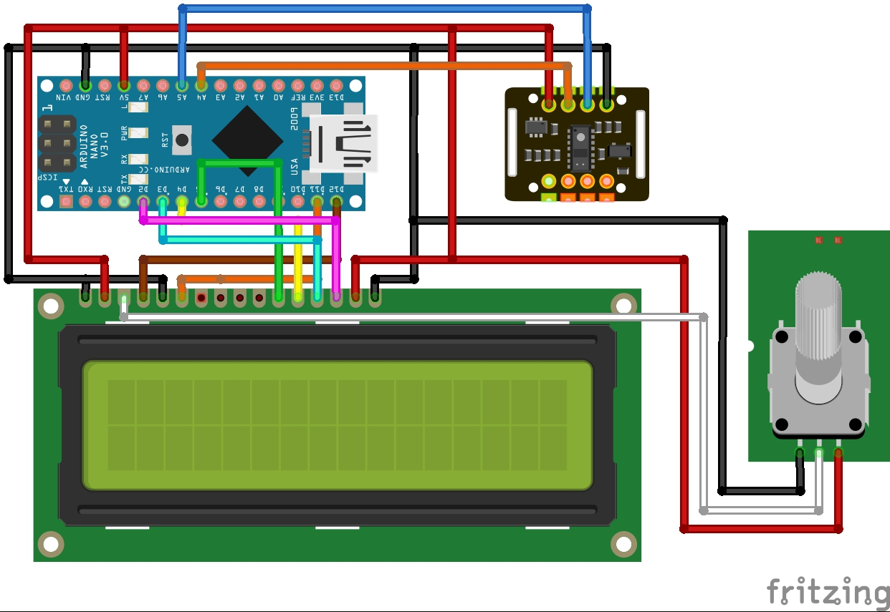

# Heart Rate and SpO2 Measurement System

> Embedded AI-enabled vital-sign monitoring pipeline for real-time heart rate and SpO2 estimation on Arduino Nano using MAX30102 photoplethysmography (PPG) sensing.

## Overview

This project implements an end-to-end edge system that acquires optical biosignals, computes heart rate and oxygen saturation, validates signal quality, and renders metrics on a local display with no cloud dependency.

It is designed for practical prototyping of low-cost health-monitoring devices where latency, simplicity, and offline operation matter.

Primary engineering goals:
- Reliable PPG signal acquisition from MAX30102 (red + IR channels)
- Deterministic on-device inference using a fixed-size sample window
- User feedback and fail-safe behavior when measurement conditions are invalid

Real-world use cases:
- At-home wellness monitoring prototypes
- Education and lab demonstrations for biomedical signal processing
- Baseline reference implementation for wearable or bedside IoT productization

## Architecture

The system follows a streaming edge-compute architecture:

Input sensing -> Signal buffering -> Algorithmic estimation -> Output rendering

Component breakdown:
- Input Layer: MAX30102 captures red/IR light absorption data over I2C
- Processing Layer: firmware maintains 100-sample buffers for red and IR channels
- AI/Algorithm Layer: SpO2 and heart-rate estimation via Maxim algorithm routine
- Validation Layer: confidence flags gate output publication (validHeartRate, validSPO2)
- Presentation Layer: 16x2 LCD displays SPO2/HR or No Finger state

Design decisions:
- Edge-only computation avoids network latency and privacy exposure
- Fixed buffer length enables predictable memory and timing on microcontrollers
- Finger-detection threshold prevents false readings during low-contact conditions

## Architecture Diagram


Diagram description:
1. Sensor Node: MAX30102 acquires Red + IR PPG stream
2. Transport: I2C data transfer to Arduino Nano
3. Buffering Block: rolling arrays of 100 samples per channel
4. Estimation Block: maxim_heart_rate_and_oxygen_saturation()
5. Validation Gate: validHeartRate AND validSPO2 checks
6. UI Output: LCD prints SPO2 and HR, or No Finger fallback state

## Features

- Real-time heart-rate and SpO2 measurement on embedded hardware
- Finger-presence detection to reduce invalid output states
- Deterministic batch estimation from synchronized red/IR samples
- Local LCD telemetry for standalone operation
- Hardware-friendly implementation for low-power microcontroller platforms

## Technical Highlights

- Signal quality gating: display updates only occur when both validity flags are true
- Embedded pipeline design: acquisition, inference, and rendering are coordinated in one control loop
- Throughput-oriented sensor setup: high sample rate and averaging tuned for robust capture
- Resource-aware implementation: static buffers and compact data types for constrained RAM
- Failure-path handling: explicit No Finger state improves operational safety and usability

## Tech Stack

- Hardware: Arduino Nano, MAX30102 sensor, 16x2 LCD, 10K potentiometer
- Firmware: Arduino C/C++
- Communication: I2C (Wire)
- Libraries:
	- MAX30105 sensor driver
	- spo2_algorithm (Maxim integrated routine)
	- LiquidCrystal
- Tooling: Arduino IDE
- Circuit design asset: Fritzing file in repository

## Getting Started

### Prerequisites

- Arduino IDE installed
- Board: Arduino Nano selected in IDE
- Sensor library available in IDE (see bundled library archive in repository)

### Hardware Setup

1. Assemble components according to the circuit reference.
2. Use the BOM:
	 - 1x Arduino Nano
	 - 1x MAX30102
	 - 1x LCD 16x2
	 - 1x 10K potentiometer

Circuit references:
- Circuit image: assets/circuit.jpg
- Editable design: Fritzing Circuit.fzz

### Circuit Design



Circuit design description:
- Arduino Nano reads MAX30102 via I2C (SDA/SCL)
- MAX30102 provides red/IR PPG signals for SpO2 and HR estimation
- 16x2 LCD is driven by digital pins for local telemetry
- 10K potentiometer is used for LCD contrast tuning

### Firmware Deployment

```bash
git clone https://github.com/kershrita/Heart-Rate-and-SpO2-measurement.git
cd Heart-Rate-and-SpO2-measurement
```

1. Open code/code.ino in Arduino IDE.
2. Install required libraries if not already present.
3. Connect Arduino Nano via USB.
4. Compile and upload.

### Runtime Flow

1. Place finger on sensor.
2. Wait for buffer fill and validity checks.
3. Read SPO2 and HR on LCD when stable; No Finger appears when contact is insufficient.

## Results

Current repository demonstrates functional real-time measurement on-device with:
- Continuous PPG acquisition from red and IR channels
- On-board computation of SpO2 and heart-rate estimates
- Validity-gated LCD display outputs

Evaluation note:
- This repo focuses on embedded system integration and live inference.
- It does not currently include a labeled benchmark dataset, statistical error report, or clinical-grade validation protocol.

## Model Details

- Model Type: deterministic physiological signal-processing algorithm (not a trained neural network)
- Selection Rationale: suitable for constrained hardware and real-time execution
- Inference Strategy: windowed estimation over synchronized red/IR signal buffers
- Quality Control: validity flags and finger-presence thresholding to suppress noisy states

## License

Released under the MIT License. See LICENSE for details.